# N8N-R8 System Architecture Overview

This document provides a comprehensive overview of the N8N-R8 system architecture, including all components, their relationships, and deployment options.

## High-Level Architecture

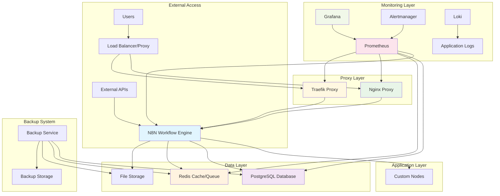

## Component Overview

### Core Components

| Component | Purpose | Technology | Port(s) |
|-----------|---------|------------|---------|
| **N8N** | Workflow automation engine | Node.js | 5678 |
| **PostgreSQL** | Primary database | PostgreSQL 15+ | 5432 |
| **Redis** | Cache and queue management | Redis 7+ | 6379 |

### Proxy Components

| Component | Purpose | Technology | Port(s) |
|-----------|---------|------------|---------|
| **Nginx** | Reverse proxy, SSL termination | Nginx | 80, 443 |
| **Traefik** | Dynamic reverse proxy, auto-SSL | Traefik v3 | 80, 443, 8080 |

### Monitoring Components

| Component | Purpose | Technology | Port(s) |
|-----------|---------|------------|---------|
| **Prometheus** | Metrics collection | Prometheus | 9090 |
| **Grafana** | Metrics visualization | Grafana | 3000 |
| **Alertmanager** | Alert management | Alertmanager | 9093 |
| **Loki** | Log aggregation | Loki | 3100 |
| **Promtail** | Log shipping | Promtail | 9080 |
| **cAdvisor** | Container metrics | cAdvisor | 8080 |
| **Node Exporter** | System metrics | Node Exporter | 9100 |

## Deployment Architectures

### 1. Development Architecture

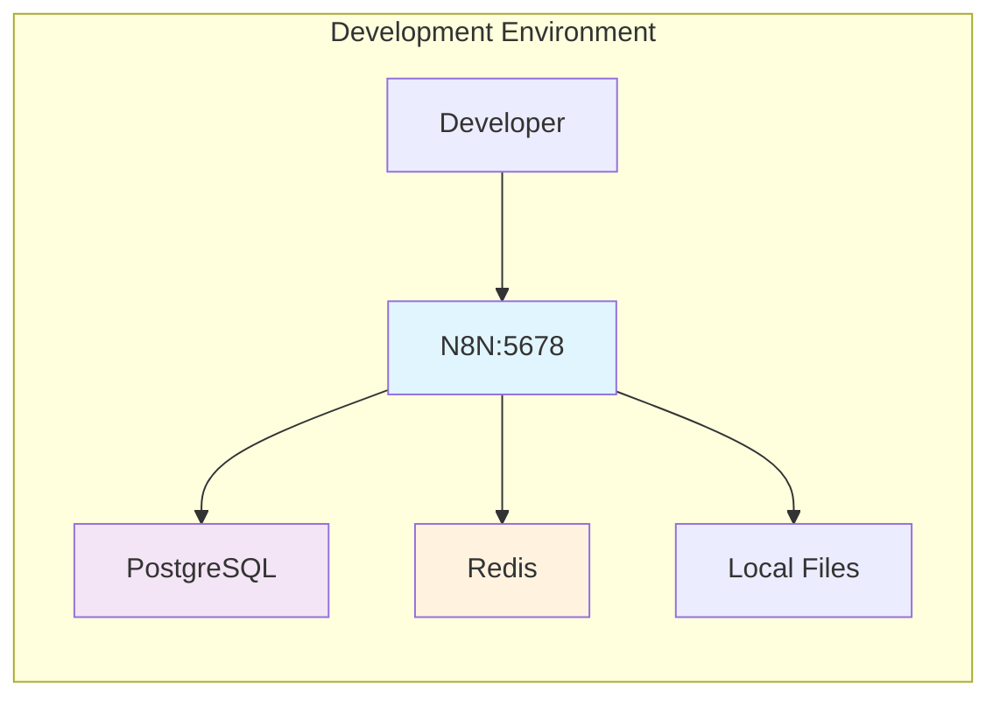

**Characteristics:**
- Direct access to N8N on port 5678
- Minimal security configuration
- Local file storage
- Basic monitoring (optional)

### 2. Production with Nginx

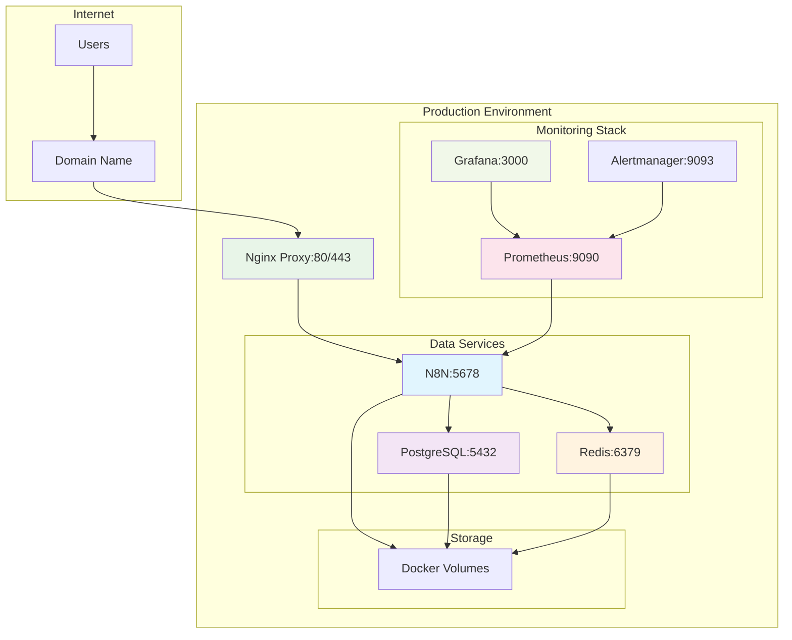

**Characteristics:**
- SSL/TLS termination at Nginx
- Static configuration
- Manual certificate management
- Production-ready security headers

### 3. Production with Traefik

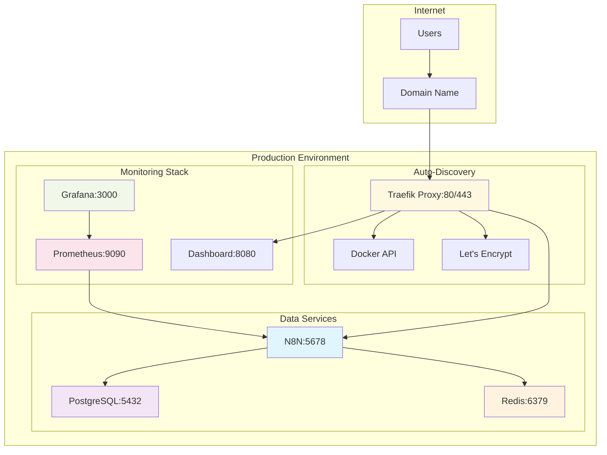

**Characteristics:**
- Automatic SSL certificate management
- Dynamic service discovery
- Built-in dashboard
- Advanced routing capabilities

## Data Flow Architecture

### 1. Workflow Execution Flow

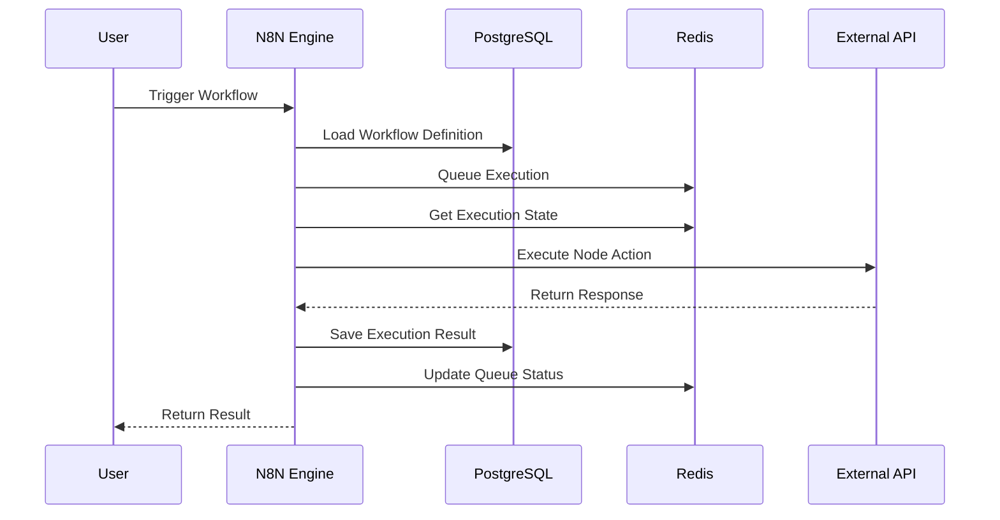

### 2. Authentication Flow

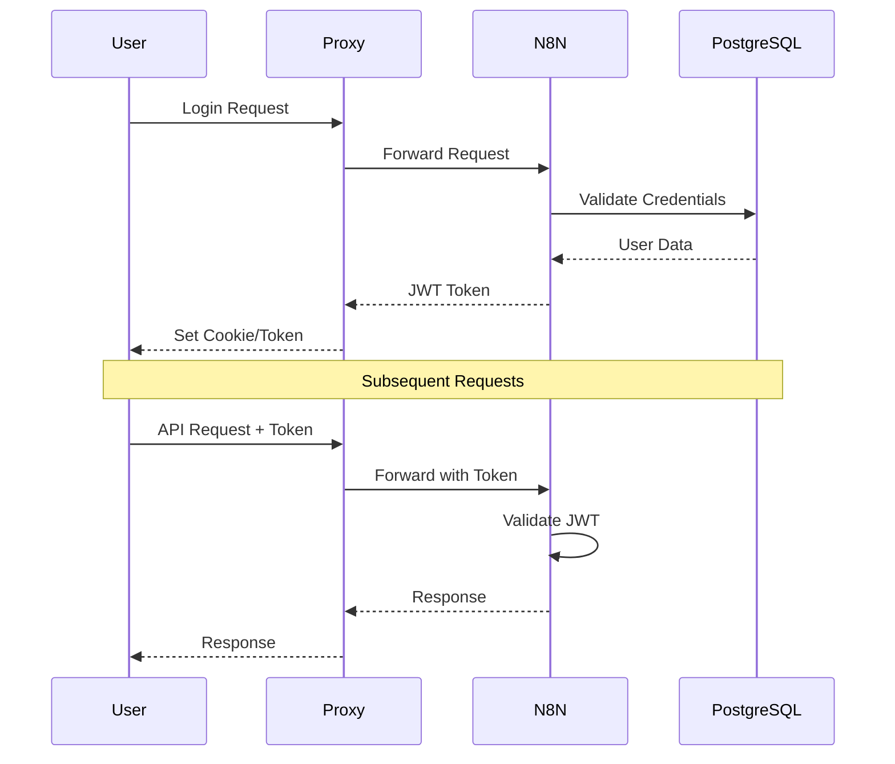

### 3. Monitoring Data Flow

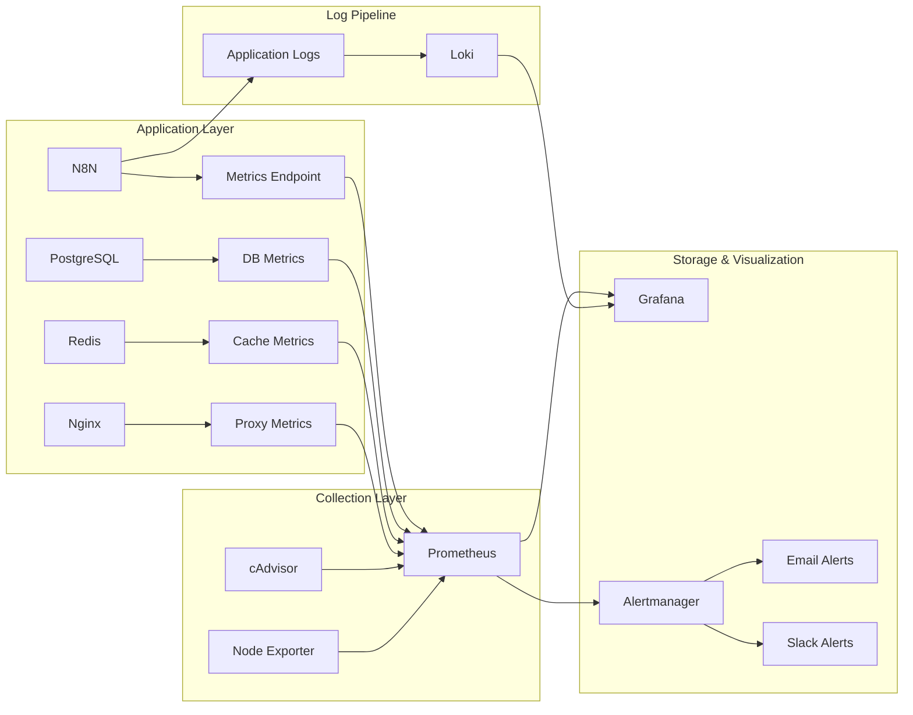

## Network Architecture

### Container Network Topology

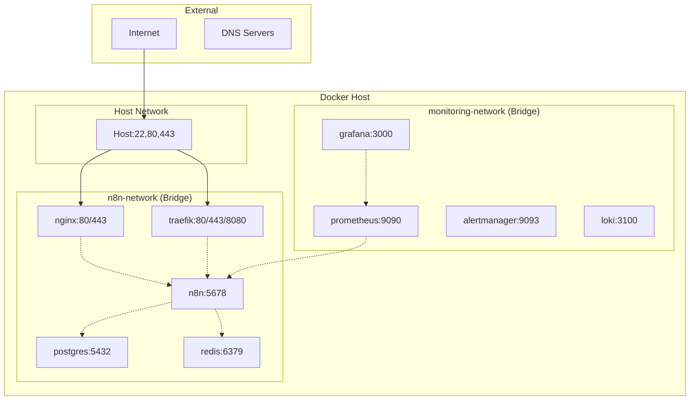

### Port Mapping Strategy

| Service | Internal Port | External Port | Protocol | Purpose |
|---------|---------------|---------------|----------|---------|
| N8N | 5678 | 5678* | HTTP | Direct access (dev only) |
| PostgreSQL | 5432 | - | TCP | Internal database |
| Redis | 6379 | - | TCP | Internal cache |
| Nginx | 80/443 | 80/443 | HTTP/HTTPS | Web proxy |
| Traefik | 80/443/8080 | 80/443/8080 | HTTP/HTTPS | Web proxy + dashboard |
| Prometheus | 9090 | 9090* | HTTP | Metrics collection |
| Grafana | 3000 | 3000* | HTTP | Dashboards |
| Alertmanager | 9093 | 9093* | HTTP | Alert management |

*Exposed only when monitoring is enabled

## Security Architecture

### Security Layers

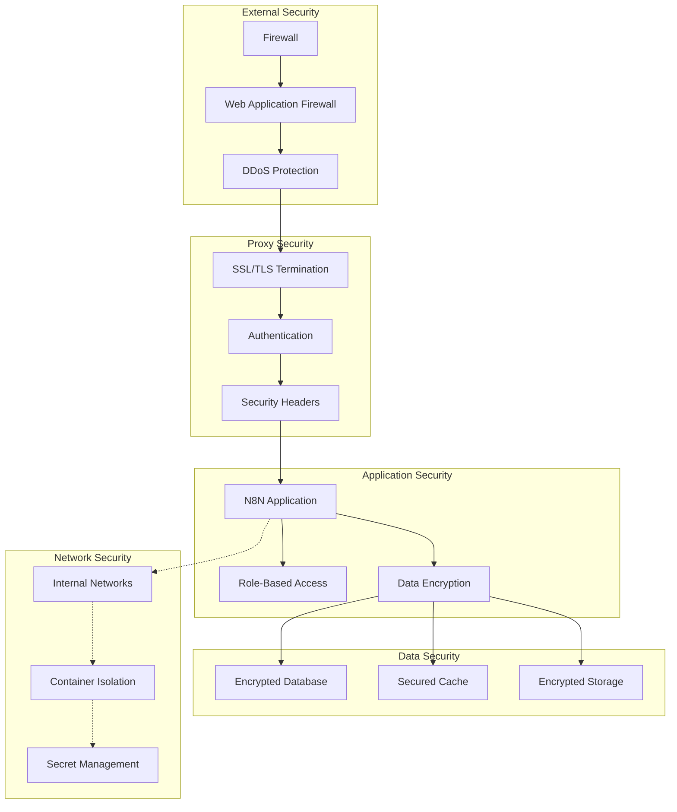

### Authentication & Authorization

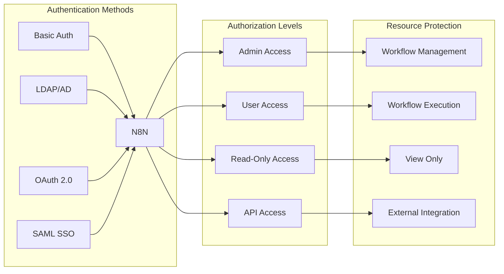

## Scalability Considerations

### Horizontal Scaling Options

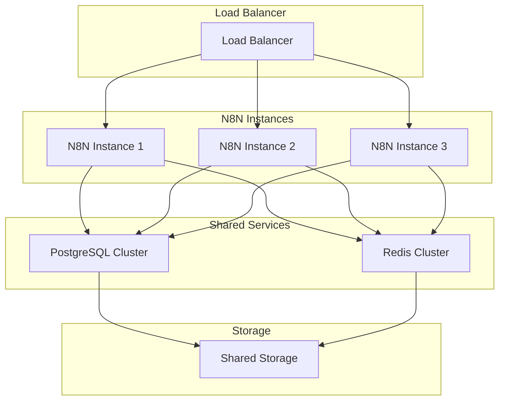

### Performance Optimization Points

1. **Database Optimization**
   - Connection pooling
   - Query optimization
   - Index management
   - Read replicas

2. **Cache Strategy**
   - Redis clustering
   - Cache warming
   - TTL optimization
   - Memory management

3. **Application Scaling**
   - Worker processes
   - Queue management
   - Resource allocation
   - Load balancing

4. **Storage Optimization**
   - SSD storage
   - Volume optimization
   - Backup strategies
   - Cleanup policies

## Technology Stack

### Core Technologies

| Layer | Technology | Version | Purpose |
|-------|------------|---------|---------|
| **Runtime** | Node.js | 18+ | Application runtime |
| **Framework** | N8N | Latest | Workflow engine |
| **Database** | PostgreSQL | 15+ | Primary data store |
| **Cache** | Redis | 7+ | Caching and queues |
| **Containerization** | Docker | 20.10+ | Application packaging |
| **Orchestration** | Docker Compose | 2.0+ | Service orchestration |

### Infrastructure Technologies

| Component | Technology | Version | Purpose |
|-----------|------------|---------|---------|
| **Proxy** | Nginx | 1.24+ | Reverse proxy |
| **Proxy** | Traefik | 3.0+ | Dynamic proxy |
| **Monitoring** | Prometheus | Latest | Metrics collection |
| **Visualization** | Grafana | Latest | Dashboards |
| **Logging** | Loki | Latest | Log aggregation |
| **Alerting** | Alertmanager | Latest | Alert management |

## Next Steps

- [Component Details](components.md) - Detailed component descriptions
- [Network Architecture](networking.md) - Network design and security
- [Data Flow](data-flow.md) - Detailed data flow diagrams
- [Deployment Guide](../deployment/production.md) - Production deployment
- [Monitoring Setup](../monitoring/setup.md) - Monitoring configuration
