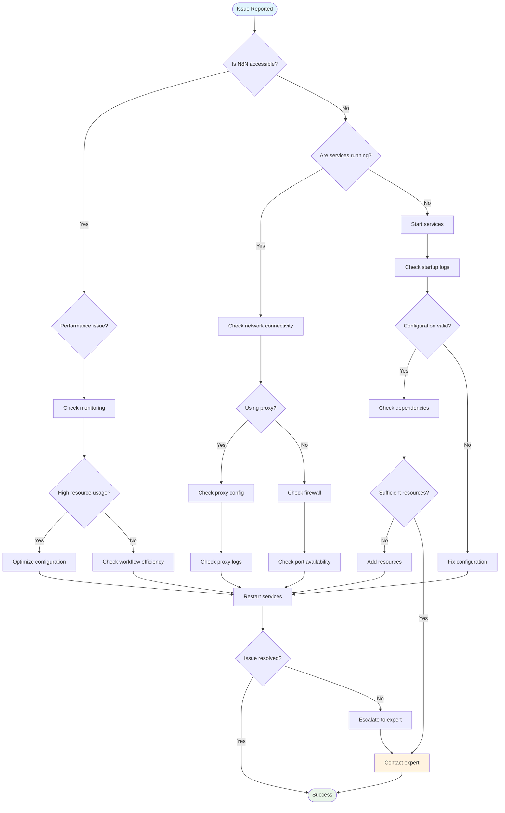
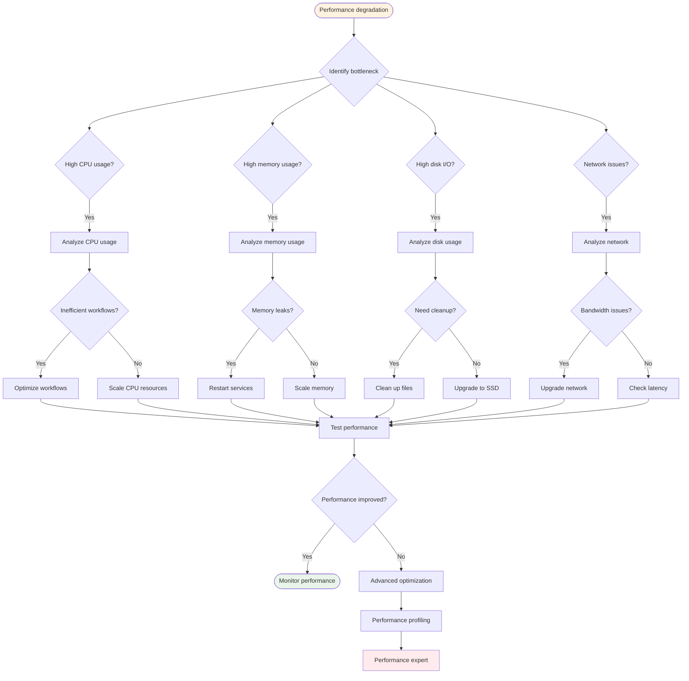
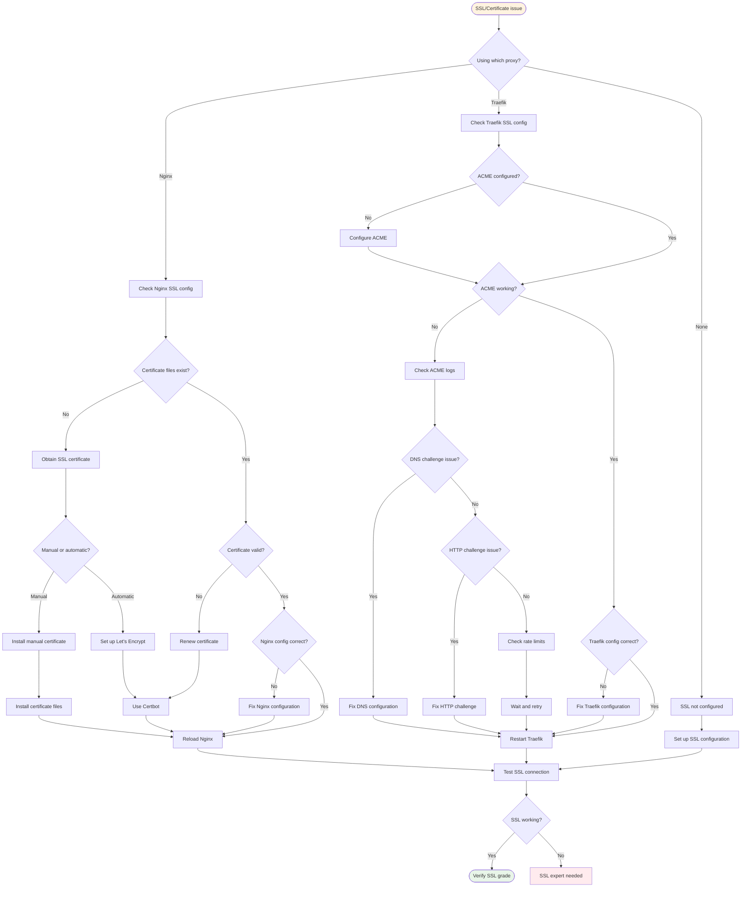
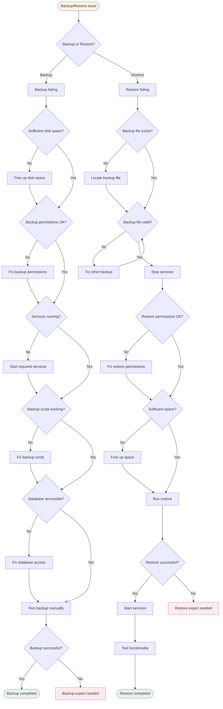

# Troubleshooting Flowcharts

This document provides visual troubleshooting flowcharts for common N8N-R8 issues. Follow the flowcharts to systematically diagnose and resolve problems.

## General Troubleshooting Flowchart



## Service Startup Issues

```mermaid
flowchart TD
    START([Service won't start]) --> DOCKER{Docker running?}
    
    DOCKER -->|No| START_DOCKER[Start Docker daemon]
    DOCKER -->|Yes| COMPOSE{Docker Compose available?}
    
    START_DOCKER --> CHECK_DOCKER[Verify Docker status]
    CHECK_DOCKER --> COMPOSE
    
    COMPOSE -->|No| INSTALL_COMPOSE[Install Docker Compose]
    COMPOSE -->|Yes| PERMISSIONS{Correct permissions?}
    
    INSTALL_COMPOSE --> PERMISSIONS
    
    PERMISSIONS -->|No| FIX_PERMS[Fix file permissions]
    PERMISSIONS -->|Yes| ENV{Environment file exists?}
    
    FIX_PERMS --> ENV
    
    ENV -->|No| CREATE_ENV[Create .env file]
    ENV -->|Yes| PORTS{Ports available?}
    
    CREATE_ENV --> PORTS
    
    PORTS -->|No| KILL_PROCESSES[Kill conflicting processes]
    PORTS -->|Yes| MEMORY{Sufficient memory?}
    
    KILL_PROCESSES --> MEMORY
    
    MEMORY -->|No| FREE_MEMORY[Free up memory]
    MEMORY -->|Yes| DISK{Sufficient disk space?}
    
    FREE_MEMORY --> DISK
    
    DISK -->|No| CLEAN_DISK[Clean up disk space]
    DISK -->|Yes| IMAGES{Docker images available?}
    
    CLEAN_DISK --> IMAGES
    
    IMAGES -->|No| PULL_IMAGES[Pull Docker images]
    IMAGES -->|Yes| NETWORK{Docker network issues?}
    
    PULL_IMAGES --> NETWORK
    
    NETWORK -->|Yes| RESET_NETWORK[Reset Docker network]
    NETWORK -->|No| START_SERVICES[Start services]
    
    RESET_NETWORK --> START_SERVICES
    
    START_SERVICES --> SUCCESS{Services started?}
    
    SUCCESS -->|Yes| VERIFY([Verify functionality])
    SUCCESS -->|No| LOGS[Check detailed logs]
    
    LOGS --> ANALYZE[Analyze error messages]
    ANALYZE --> EXPERT[Contact expert support]
    
    style START fill:#ffebee
    style VERIFY fill:#e8f5e8
    style EXPERT fill:#fff3e0
```



## Database Connection Issues

```mermaid
flowchart TD
    START([Database connection failed]) --> PG_RUNNING{PostgreSQL running?}
    
    PG_RUNNING -->|No| START_PG[Start PostgreSQL service]
    PG_RUNNING -->|Yes| CREDS{Credentials correct?}
    
    START_PG --> WAIT[Wait for startup]
    WAIT --> CREDS
    
    CREDS -->|No| FIX_CREDS[Fix database credentials]
    CREDS -->|Yes| HOST{Host reachable?}
    
    FIX_CREDS --> RESTART_N8N[Restart N8N]
    
    HOST -->|No| NETWORK_ISSUE[Check network connectivity]
    HOST -->|Yes| PORT{Port accessible?}
    
    NETWORK_ISSUE --> CHECK_FIREWALL[Check firewall rules]
    CHECK_FIREWALL --> PORT
    
    PORT -->|No| CHECK_PORT[Verify PostgreSQL port]
    PORT -->|Yes| DB_EXISTS{Database exists?}
    
    CHECK_PORT --> PG_CONFIG[Check PostgreSQL config]
    PG_CONFIG --> DB_EXISTS
    
    DB_EXISTS -->|No| CREATE_DB[Create database]
    DB_EXISTS -->|Yes| PERMS{User permissions OK?}
    
    CREATE_DB --> PERMS
    
    PERMS -->|No| GRANT_PERMS[Grant database permissions]
    PERMS -->|Yes| CONNECTIONS{Connection limit reached?}
    
    GRANT_PERMS --> CONNECTIONS
    
    CONNECTIONS -->|Yes| KILL_CONNECTIONS[Kill idle connections]
    CONNECTIONS -->|No| POOL{Connection pool issues?}
    
    KILL_CONNECTIONS --> POOL
    
    POOL -->|Yes| RESET_POOL[Reset connection pool]
    POOL -->|No| LOCKS{Database locks?}
    
    RESET_POOL --> LOCKS
    
    LOCKS -->|Yes| CLEAR_LOCKS[Clear database locks]
    LOCKS -->|No| CORRUPTION{Database corruption?}
    
    CLEAR_LOCKS --> TEST_CONNECTION[Test connection]
    
    CORRUPTION -->|Yes| RESTORE_DB[Restore from backup]
    CORRUPTION -->|No| TEST_CONNECTION
    
    RESTORE_DB --> TEST_CONNECTION
    RESTART_N8N --> TEST_CONNECTION
    
    TEST_CONNECTION --> SUCCESS{Connection works?}
    
    SUCCESS -->|Yes| MONITOR([Monitor stability])
    SUCCESS -->|No| EXPERT[Database expert needed]
    
    style START fill:#ffebee
    style MONITOR fill:#e8f5e8
    style EXPERT fill:#fff3e0
```



## Performance Issues



## SSL/Certificate Issues



## Backup/Restore Issues



## Monitoring Issues

```mermaid
flowchart TD
    START([Monitoring not working]) --> MONITORING_TYPE{Which monitoring?}
    
    MONITORING_TYPE -->|Basic| BASIC_MON[Basic monitoring scripts]
    MONITORING_TYPE -->|Full| FULL_MON[Full monitoring stack]
    
    BASIC_MON --> SCRIPTS_EXIST{Monitoring scripts exist?}
    SCRIPTS_EXIST -->|No| INSTALL_SCRIPTS[Install monitoring scripts]
    SCRIPTS_EXIST -->|Yes| SCRIPTS_EXEC{Scripts executable?}
    
    INSTALL_SCRIPTS --> SCRIPTS_EXEC
    
    SCRIPTS_EXEC -->|No| CHMOD_SCRIPTS[Make scripts executable]
    SCRIPTS_EXEC -->|Yes| SCRIPT_CONFIG{Script configuration OK?}
    
    CHMOD_SCRIPTS --> SCRIPT_CONFIG
    
    SCRIPT_CONFIG -->|No| FIX_SCRIPT_CONFIG[Fix script configuration]
    SCRIPT_CONFIG -->|Yes| RUN_SCRIPTS[Run monitoring scripts]
    
    FIX_SCRIPT_CONFIG --> RUN_SCRIPTS
    
    FULL_MON --> PROM_RUNNING{Prometheus running?}
    PROM_RUNNING -->|No| START_PROM[Start Prometheus]
    PROM_RUNNING -->|Yes| PROM_CONFIG{Prometheus config OK?}
    
    START_PROM --> PROM_CONFIG
    
    PROM_CONFIG -->|No| FIX_PROM_CONFIG[Fix Prometheus config]
    PROM_CONFIG -->|Yes| TARGETS{Targets reachable?}
    
    FIX_PROM_CONFIG --> TARGETS
    
    TARGETS -->|No| FIX_TARGETS[Fix target connectivity]
    TARGETS -->|Yes| GRAFANA_RUNNING{Grafana running?}
    
    FIX_TARGETS --> GRAFANA_RUNNING
    
    GRAFANA_RUNNING -->|No| START_GRAFANA[Start Grafana]
    GRAFANA_RUNNING -->|Yes| DASHBOARDS{Dashboards loaded?}
    
    START_GRAFANA --> DASHBOARDS
    
    DASHBOARDS -->|No| IMPORT_DASHBOARDS[Import dashboards]
    DASHBOARDS -->|Yes| ALERTS{Alerts working?}
    
    IMPORT_DASHBOARDS --> ALERTS
    
    ALERTS -->|No| FIX_ALERTS[Fix alert configuration]
    ALERTS -->|Yes| TEST_MONITORING[Test monitoring]
    
    FIX_ALERTS --> TEST_MONITORING
    RUN_SCRIPTS --> TEST_MONITORING
    
    TEST_MONITORING --> MON_WORKING{Monitoring working?}
    
    MON_WORKING -->|Yes| MON_SUCCESS([Monitoring operational])
    MON_WORKING -->|No| MON_EXPERT[Monitoring expert needed]
    
    style START fill:#fff3e0
    style MON_SUCCESS fill:#e8f5e8
    style MON_EXPERT fill:#ffebee
```



## Quick Reference Commands

### Diagnostic Commands

```bash
# Check service status
docker compose ps

# Check logs
docker compose logs -f [service_name]

# Check resource usage
docker stats

# Check disk space
df -h

# Check memory usage
free -h

# Check network connectivity
curl -I http://localhost:5678

# Check database connection
docker compose exec postgres psql -U n8n -d n8n -c "SELECT 1;"

# Check Redis connection
docker compose exec redis redis-cli ping
```

### Recovery Commands

```bash
# Restart all services
docker compose restart

# Rebuild and restart
docker compose up -d --build

# Clean restart
docker compose down && docker compose up -d

# Reset everything
make clean && make start

# Check and fix permissions
sudo chown -R 1000:1000 data/
chmod -R 755 data/
```

### Emergency Procedures

1. **Complete System Recovery**
   ```bash
   # Stop everything
   docker compose down --remove-orphans
   
   # Clean up
   docker system prune -f
   
   # Restart
   docker compose up -d
   ```

2. **Database Recovery**
   ```bash
   # Stop N8N
   docker compose stop n8n
   
   # Restart database
   docker compose restart postgres
   
   # Start N8N
   docker compose start n8n
   ```

3. **Network Issues**
   ```bash
   # Recreate networks
   docker compose down
   docker network prune -f
   docker compose up -d
   ```

## Escalation Guidelines

### When to Escalate

- Multiple troubleshooting attempts failed
- Data corruption suspected
- Security breach indicators
- Performance degradation > 50%
- Service downtime > 30 minutes

### Information to Collect

1. **System Information**
   - OS version and architecture
   - Docker and Docker Compose versions
   - Available resources (CPU, memory, disk)

2. **Service Logs**
   - N8N application logs
   - Database logs
   - Proxy logs
   - System logs

3. **Configuration Files**
   - docker-compose.yml
   - .env file (sanitized)
   - Proxy configurations
   - Monitoring configurations

4. **Error Details**
   - Exact error messages
   - Steps to reproduce
   - Timeline of issues
   - Recent changes made
