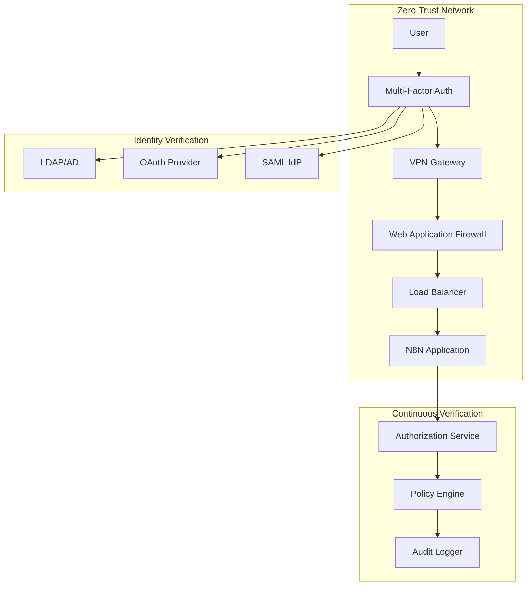
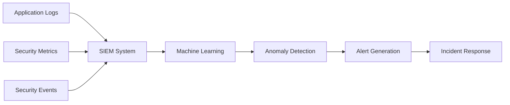

# N8N-R8 Security Framework

This directory contains comprehensive security enhancements for the N8N-R8 project, including secrets management, vulnerability scanning, and security automation.

## Security Components

```
security/
├── secrets/                    # Secrets management
│   ├── vault-config.hcl       # HashiCorp Vault configuration
│   ├── secrets-manager.sh     # Secrets management script
│   ├── rotate-secrets.sh      # Secret rotation automation
│   └── init-vault.sh          # Vault initialization script
├── scanning/                   # Vulnerability scanning
│   ├── scan-containers.sh     # Container security scanning
│   ├── scan-dependencies.sh   # Dependency vulnerability scanning
│   ├── scan-config.sh         # Configuration security scanning
│   └── security-report.sh     # Security report generation
├── hardening/                  # System hardening
│   ├── docker-hardening.sh    # Docker security hardening
│   ├── network-security.sh    # Network security configuration
│   ├── file-permissions.sh    # File permission hardening
│   └── audit-config.sh        # Security audit configuration
├── monitoring/                 # Security monitoring
│   ├── security-alerts.yml    # Security-specific alerts
│   ├── intrusion-detection.sh # Basic intrusion detection
│   ├── log-analysis.sh        # Security log analysis
│   └── threat-detection.yml   # Threat detection rules
├── compliance/                 # Compliance frameworks
│   ├── cis-benchmark.sh       # CIS benchmark compliance
│   ├── gdpr-compliance.md     # GDPR compliance guide
│   ├── soc2-checklist.md      # SOC 2 compliance checklist
│   └── audit-trail.sh         # Audit trail generation
├── backup-security/            # Backup security
│   ├── encrypt-backups.sh     # Backup encryption
│   ├── secure-restore.sh      # Secure restore procedures
│   └── backup-integrity.sh    # Backup integrity verification
├── docker-compose.security.yml # Security-enhanced Docker Compose
├── security-config.env        # Security configuration
└── README.md                   # This file
```

## Quick Start

### 1. Initialize Security Framework
```bash
# Set up basic security
./security/setup-security.sh

# Initialize secrets management
./security/secrets/init-vault.sh

# Run security hardening
./security/hardening/docker-hardening.sh
```

### 2. Enable Vulnerability Scanning
```bash
# Scan containers for vulnerabilities
./security/scanning/scan-containers.sh

# Scan dependencies
./security/scanning/scan-dependencies.sh

# Generate security report
./security/scanning/security-report.sh
```

### 3. Deploy with Enhanced Security
```bash
# Start with security enhancements
docker compose -f docker-compose.yml -f security/docker-compose.security.yml up -d

# Enable security monitoring
make security-monitor

# Run compliance checks
./security/compliance/cis-benchmark.sh
```

## Security Features

### 🔐 Secrets Management
- **HashiCorp Vault Integration**: Secure secret storage and rotation
- **Environment Variable Encryption**: Encrypted .env files
- **Automatic Secret Rotation**: Scheduled secret updates
- **Secret Injection**: Runtime secret injection without exposure

### 🛡️ Vulnerability Scanning
- **Container Scanning**: CVE detection in Docker images
- **Dependency Scanning**: NPM/package vulnerability detection
- **Configuration Scanning**: Security misconfigurations
- **Continuous Monitoring**: Automated security assessments

### 🔒 System Hardening
- **Docker Security**: Container security best practices
- **Network Isolation**: Secure network configurations
- **File Permissions**: Proper access controls
- **Service Hardening**: Secure service configurations

### 📊 Security Monitoring
- **Real-time Alerts**: Security event notifications
- **Intrusion Detection**: Basic intrusion detection system
- **Log Analysis**: Security-focused log monitoring
- **Threat Detection**: Automated threat identification

### 📋 Compliance
- **CIS Benchmarks**: Industry security standards
- **GDPR Compliance**: Data protection compliance
- **SOC 2**: Security controls framework
- **Audit Trails**: Comprehensive audit logging

## Security Levels

### Level 1: Basic Security (Default)
- Basic authentication
- HTTPS encryption
- Container isolation
- Regular updates

### Level 2: Enhanced Security
- Secrets management
- Vulnerability scanning
- Security monitoring
- Access controls

### Level 3: Enterprise Security
- Advanced threat detection
- Compliance frameworks
- Audit logging
- Incident response

## Configuration

### Security Environment Variables

```bash
# Secrets Management
VAULT_ENABLED=true
VAULT_URL=http://localhost:8200
VAULT_TOKEN_FILE=/run/secrets/vault_token

# Vulnerability Scanning
SECURITY_SCAN_ENABLED=true
SECURITY_SCAN_SCHEDULE="0 2 * * *"
SECURITY_SCAN_THRESHOLD=medium

# Monitoring
SECURITY_MONITORING=true
INTRUSION_DETECTION=true
SECURITY_ALERTS_EMAIL=security@example.com

# Compliance
CIS_BENCHMARK_ENABLED=true
AUDIT_LOGGING=true
COMPLIANCE_REPORTS=true
```

### Security Policies

1. **Password Policy**
   - Minimum 12 characters
   - Mixed case, numbers, symbols
   - No dictionary words
   - Regular rotation

2. **Access Control**
   - Principle of least privilege
   - Role-based access control
   - Multi-factor authentication
   - Session management

3. **Data Protection**
   - Encryption at rest
   - Encryption in transit
   - Data classification
   - Backup encryption

4. **Incident Response**
   - Automated detection
   - Alert escalation
   - Incident logging
   - Recovery procedures

## Security Checklist

### Pre-Deployment Security
- [ ] Change all default passwords
- [ ] Generate secure encryption keys
- [ ] Configure SSL/TLS certificates
- [ ] Set up firewall rules
- [ ] Enable security monitoring
- [ ] Configure backup encryption
- [ ] Review access controls
- [ ] Test incident response

### Ongoing Security
- [ ] Regular vulnerability scans
- [ ] Security patch updates
- [ ] Access review audits
- [ ] Backup integrity checks
- [ ] Security log analysis
- [ ] Compliance assessments
- [ ] Incident response drills
- [ ] Security training updates

## Integration with Existing Systems

### Monitoring Integration
The security framework integrates with the existing monitoring system:
- Security metrics in Prometheus
- Security dashboards in Grafana
- Security alerts in Alertmanager
- Security logs in Loki

### Custom Nodes Integration
Security considerations for custom nodes:
- Code security scanning
- Dependency vulnerability checks
- Runtime security monitoring
- Secure deployment practices

### Backup Integration
Enhanced backup security:
- Encrypted backup storage
- Secure backup transmission
- Backup integrity verification
- Secure restore procedures

## Advanced Security Features

### Zero-Trust Architecture


### Threat Detection Pipeline


## Security Tools Integration

### External Security Tools
- **Vault**: Secret management
- **Trivy**: Container vulnerability scanning
- **OWASP ZAP**: Web application security testing
- **Falco**: Runtime security monitoring
- **Anchore**: Container security analysis

### Security APIs
- **CVE Database**: Vulnerability information
- **Threat Intelligence**: Security threat data
- **Certificate Transparency**: SSL certificate monitoring
- **Security Advisories**: Security update notifications

## Incident Response

### Automated Response Actions
1. **High Severity Alerts**
   - Immediate notification
   - Service isolation
   - Backup trigger
   - Incident logging

2. **Medium Severity Alerts**
   - Alert notification
   - Monitoring increase
   - Log collection
   - Analysis queue

3. **Low Severity Alerts**
   - Log entry
   - Trend analysis
   - Scheduled review
   - Preventive measures

### Manual Response Procedures
1. **Incident Assessment**
2. **Containment Actions**
3. **Evidence Collection**
4. **System Recovery**
5. **Post-Incident Review**

## Getting Started

1. **Review Security Requirements**
   ```bash
   # Check current security status
   ./security/scanning/security-report.sh --assessment
   ```

2. **Initialize Security Framework**
   ```bash
   # Set up security components
   ./security/setup-security.sh --level enhanced
   ```

3. **Deploy with Security**
   ```bash
   # Start with security enhancements
   make start-secure
   ```

4. **Monitor Security Status**
   ```bash
   # Check security dashboard
   make security-status
   ```

## Support and Documentation

- [Security Configuration Guide](hardening/README.md)
- [Vulnerability Scanning Guide](scanning/README.md)
- [Secrets Management Guide](secrets/README.md)
- [Compliance Guide](compliance/README.md)
- [Incident Response Playbook](monitoring/incident-response.md)
